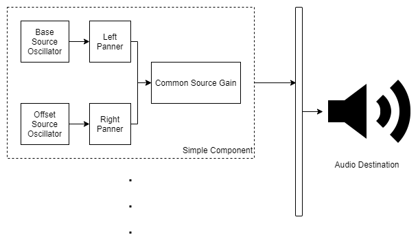

# Binaurealis

## Todo.txt

2020-07-29 Add input elements to FRUI.
2020-07-29 Also center-align the buttons, and make the UI a little more appealing. Also add tooltips.
2020-07-29 Write an enticing introduction to add to the HTML page and the README
2020-07-29 Also find out about Git CI and add the React build pipeline to it.

## Current design idea

The following design idea just popped up in my head, and I will be jotting it down here for assisting me in any kind of future reference.

This basic project is supposed to allow me to generate very simple binaural beats, of various frequencies (lookup [Brain waves and induction](#references)), and help me pay attention.

[Binaural sounds](#references) by definition simply mean making the ears hear multiple different sounds simultaneously to offer an immersive experience. Various adjustments like slight differences in frequency or time can make us experience just that. Furthermore, generating very specific beat frequencies also have other rumored benefits.

Driven by speculation, a will to experiment the possible benefits of binaural sounds, and an innate desire to learn React, I have decided to build this very simple sound generator.

### High level requirements

- Generate multiple different tones, carefully **static** stereo-panned, so that each ear receives a slightly different sound (tone). Delay will not matter here, since we are generating **tones**.
- Supporting mirroring of left and right sound channels, while also allowing user to follow a lookup table of various recommended _beat frequencies_, and preferably also allowing the user to choose their own custom beat frequency.
- Allowing the user to choose a custom base frequency for any of the multiple channels.
- Variable volume, customisable type of sound wave(sine, triangle).
- Ability to insert new sources (with the sources always being inserted as pairs).
- Support to pause/resume.

- A common pause/resume button (with a fade-out on pause)
- Common volume slider (muting pauses?).
- Each source supporting a unique sound type (sine or triangle)
- Each source having a base frequency, and a beat frequency slider.
- Each source has two channels, one panned completely to the left, and the other panned completely to the right.
- Also, individual pause/resume buttons, and volume sliders for each source?

## Implementation

React components. Loads and loads of React Components. Each of them seamlessly fused together.
Sound API should be run over function wrappers for ease of functionality, and channel integrations should happen as follows:

The concept of audio routing graphs with various nodes(sources and sinks) perfectly fits the description for compatibility with React components and can easily make for a nice application. Let's see how this goes!

## Lookup Table

Frequency range | Name | Usually associated with
---: | :---: | :---
40 Hz and above | Gamma waves | Higher mental activity, including perception, problem solving, and consciousness
13–39 Hz | Beta waves | Active, busy thinking, active processing , active concentration, arousal, and cognition
7–13 Hz | Alpha waves | Calm relaxed yet alert state
4–7 Hz | Theta waves | Deep meditation /relaxation, REM sleep
4 Hz and below | Delta waves | Deep dreamless sleep, loss of body awareness

---

## References

1. [Types of brain waves and induction](https://itsusync.com/different-types-of-brain-waves-delta-theta-alpha-beta-gamma-ezp-9)
2. [Binaural recordings](https://en.wikipedia.org/wiki/Binaural_recording)
3. [Using Web-Audio API](https://developer.mozilla.org/en-US/docs/Web/API/Web_Audio_API/Using_Web_Audio_API)
4. [ReactJS tutorial](https://reactjs.org/tutorial/tutorial.html)
